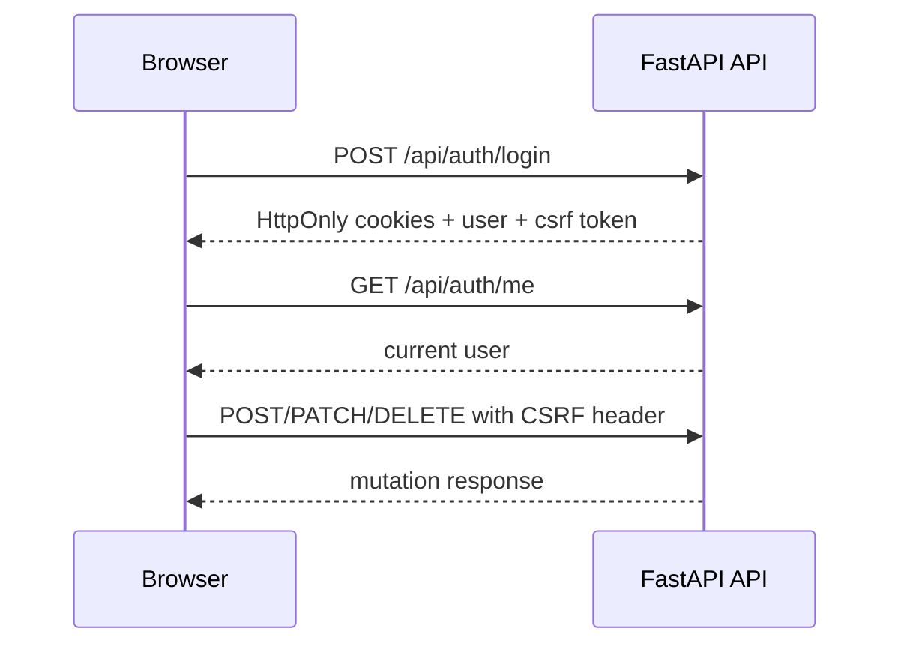

Moldy API authentication is session-cookie based for the browser application. After login, the API sets HttpOnly cookies and returns a CSRF value that the frontend sends on state-changing requests.

This page explains the authentication model behind the API Reference. Use it to distinguish normal session failures, CSRF failures, operator-permission failures, and Agent API key failures before debugging individual endpoints.

## Authentication flow

## Main endpoints

| Endpoint | Purpose |
| --- | --- |
| `POST /api/auth/register` | Create an account |
| `POST /api/auth/login` | Verify email/password, set cookies, return CSRF value |
| `POST /api/auth/logout` | Clear session cookies |
| `POST /api/auth/refresh` | Refresh the session |
| `GET /api/auth/me` | Read the current user |
| `PATCH /api/auth/me/profile` | Update display name and avatar metadata |
| `/api/auth/me/avatar-image` | Upload, read, or delete the current user's avatar image |

## Requests that need CSRF

State-changing requests must pass CSRF validation. Any backend route using `verify_csrf` expects the browser session's CSRF value.

Common examples:

- Create, update, and delete agents
- Send, resume, edit, and regenerate conversation messages
- Create, update, delete, and test credentials
- Create, update, delete, probe, discover, and import MCP servers
- Create, update, delete, and run schedules
- Install, publish, update, enable, or disable marketplace items
- Create and revoke share links
- Update profile, memory, files, Agent API deployments, and Agent API keys

Read-only requests usually rely on the authenticated session alone, while mutation requests require both the session cookie and the CSRF header. This split protects normal browser use without requiring callers to place bearer tokens in documentation examples.

## Operator permission

Endpoints that require `super_user` reject regular users.

| Feature | Protected area |
| --- | --- |
| System credentials | `/api/system-credentials` |
| System LLM | `/api/system-llm-settings` |
| Model catalog mutation | `POST/PATCH/DELETE /api/models` |
| Marketplace listing | `/api/marketplace/admin/items/{item_id}/listed` |
| k-skill sync status | `/api/marketplace/admin/k-skill/sync` |

Operator permission is independent from CSRF. A request can pass CSRF validation and still fail if the authenticated user is not a `super_user`.

## Agent API keys

The public `/v1/*` Agent API runtime does not use browser cookies. It uses server-side API keys created in **Settings > Agent API**. Keys can be scoped to `invoke`, `stream`, `background`, and `read`, and can be limited to selected deployments.

Keep browser session APIs and Agent API runtime calls separate:

| Surface | Authentication |
| --- | --- |
| `/api/*` browser app endpoints | HttpOnly session cookies and CSRF for mutations |
| `/v1/*` Agent API runtime endpoints | Agent API key with the required scope |

<Warning>
Do not include real cookies, CSRF tokens, or API keys in examples or screenshots.
</Warning>
