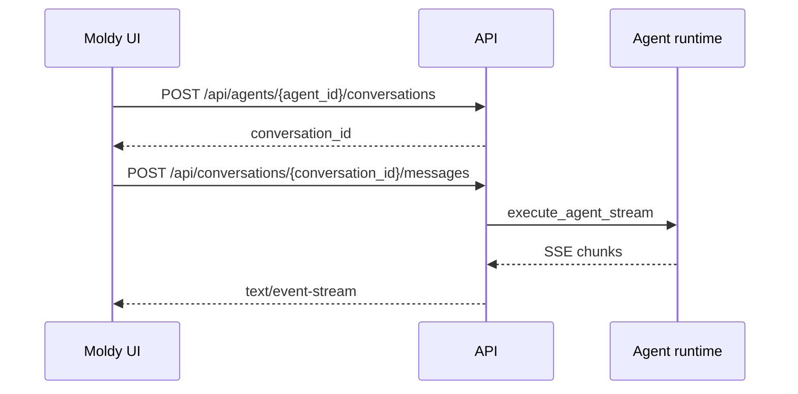

Moldy chat uses Server-Sent Events to stream agent responses. A client creates or selects a conversation, sends a message, and receives a `text/event-stream` response that can include text chunks, tool events, errors, and completion metadata.

The backend wraps send, resume, edit, and regenerate flows with the same SSE handling pattern. This lets the UI reuse one streaming client path while still supporting branch, interrupt, and retry workflows.

## Basic flow

## Conversation and message endpoints

| Endpoint | Purpose |
| --- | --- |
| `GET /api/agents/{agent_id}/conversations` | List conversations for an agent |
| `POST /api/agents/{agent_id}/conversations` | Create a conversation |
| `GET /api/conversations/{conversation_id}/messages` | Read messages and branch metadata |
| `POST /api/conversations/{conversation_id}/messages` | Send a user message and receive SSE |
| `GET /api/conversations/{conversation_id}/stream` | Reconnect to a stream by run id |
| `POST /api/conversations/{conversation_id}/messages/resume` | Resume after an interrupt |
| `POST /api/conversations/{conversation_id}/messages/edit` | Edit a previous message and rerun |
| `POST /api/conversations/{conversation_id}/messages/regenerate` | Regenerate an assistant response |
| `POST /api/conversations/{conversation_id}/messages/switch-branch` | Switch conversation branch |

## Runtime configuration

When a message is sent, the backend loads the conversation and agent together and builds runtime configuration with:

- Model provider, model_name, and base_url
- User-owned LLM credential
- Agent system prompt
- Built-in tool and MCP tool configuration
- Attached skills
- Middleware configuration
- Model parameters and fallback chain
- thread_id and checkpoint_id
- Model pricing metadata for cost calculation

The runtime configuration is assembled from saved agent settings and user-owned credentials. System credentials are reserved for platform flows and are not a general replacement for the user's chat credential.

## Resume, edit, and regenerate

| Flow | Use when |
| --- | --- |
| resume | Continue the same run after tool approval or interrupt |
| edit | Change an earlier user message and rerun from that point |
| regenerate | Produce a new assistant response for the same user message |

All three flows stream responses, so clients can reuse the same SSE handling used for normal sends.

## Trace and files

Moldy exposes conversation traces and debug traces. Conversation files are served from `/api/conversations/{conversation_id}/files/{file_path}`. Public share links can include selected trace information in the read-only snapshot.

Trace pages are the best source for explaining why a streaming run failed because they connect model calls, tool calls, runtime steps, and error messages to one conversation run.

<Tip>
If a stream disconnects, first check the stream reconnect path using `X-Run-Id` or the run id stored by the client.
</Tip>
