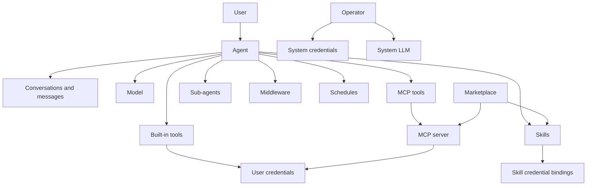

Moldy organizes agent work around one runnable unit: the agent. Agents connect conversations, model calls, tools, MCP servers, skills, credentials, schedules, usage, and marketplace resources.

Use this page as a glossary for the rest of the documentation. Each concept below names the Moldy object, explains where it appears in the product, and states the boundary that matters when configuring or troubleshooting it.

## Agents

An agent is the runnable unit in Moldy. It can have a name, description, system instructions, model, model parameters, fallback models, tools, MCP tools, skills, sub-agents, middleware, opener questions, and schedules.

The saved agent record is the source that chat, test chat, and schedules load at runtime. If an agent behaves differently than expected, check the saved settings before checking the runtime trace.

When creating an agent, answer three questions:

- What work is this agent responsible for?
- Does it only answer, or does it need to run external tools?
- Will users run it manually, or should schedules run it automatically?

## Conversations and messages

A conversation is an agent-specific thread. Messages, files, tool results, usage, and trace information are attached to conversations. When a message is sent, the server reads the agent configuration and streams the response with SSE.

Conversations support branch switching, edit, regenerate, and resume flows. Resume is used when execution continues after approval or interrupt.

## Tools and MCP tools

Tools are actions an agent can execute. Moldy separates regular tools from MCP tools discovered from registered MCP servers.

| Item | Description |
| --- | --- |
| Tool | A single registered action |
| MCP server | A server that exposes external tools |
| MCP tool | A tool imported from an MCP server |

Even after an MCP server is registered and tools are discovered, you still attach specific MCP tools in agent settings.

## Skills

Skills package knowledge, instructions, files, or executable assets. Skills can be attached to agents, published to the marketplace, and declare credential requirements.

Skills are useful when:

- You want reusable business knowledge or files
- You do not want to repeat the same instructions across agents
- You want to publish a shareable package

## Sub-agents and middleware

Sub-agents let one agent use another agent as a helper. Middleware extends runtime behavior. Both are selected in agent settings, and the backend validates duplicate sub-agent IDs and unknown middleware types.

## Models and credentials

Models are LLM catalog entries. Credentials are secrets used to call models or tools.

| Type | Managed by | Used for |
| --- | --- | --- |
| User credentials | Regular users | User agents, tools, MCP servers, model tests |
| System credentials | Operators | Builder, Assistant, image generation, System LLM |
| Model catalog | Mostly operators | Agent model selection, System LLM selection |

User chat runtime uses user-owned LLM credentials. System credentials are reserved for operator-scoped platform flows.

## Schedules

Schedules are triggers that run agents automatically. Moldy accepts `interval`, `cron`, and `one_time` trigger types, and connects run results back to run records and conversations.

Schedules include:

- Input message
- Timezone
- Conversation policy and target conversation
- Max runs
- End time
- Auto-pause threshold after failures

## Marketplace

The marketplace is a catalog for discovering and installing skills, agents, and MCP resources. The current implementation includes catalog, detail, versions, install, update, uninstall, skill publish, ACL, and operator listing management.

## Access and public sharing

Most resources are scoped to the current user. Operator features require `super_user`. Share links are the exception: they expose a read-only conversation snapshot without login.

This ownership model is the most important constraint across Moldy. User-owned resources should not appear in another user's normal lists, and operator resources should not be editable from regular user accounts.
