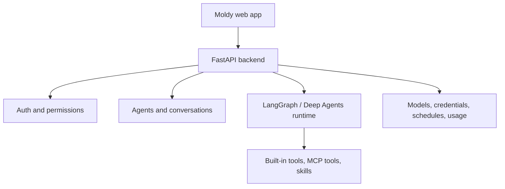

Moldy is a web application for building and operating AI agents through chat, templates, or manual configuration. Agents can use models, fallback models, tools, MCP tools, skills, sub-agents, middleware, schedules, credentials, memory, generated files, marketplace resources, Agent API deployments, and conversation share links.

This documentation is grounded in the current Next.js frontend, FastAPI OpenAPI schema, and live browser screens. It documents confirmed Moldy behavior and avoids describing external product features that are not present in Moldy source.

## What you can do

- Create agents with a conversational builder, manual configuration, or templates.
- Chat with agents, manage conversations, create share links, and update visual settings.
- Extend agents with tools, MCP servers, and skills.
- Separate user credentials, system credentials, model catalog entries, memory, files, and System LLM settings.
- Monitor schedules, usage, marketplace resources, and operator-only settings.
- Deploy eligible fixed-identity agents through Agent API for server-side external calls.

## Product structure

## Documentation evidence

| Evidence type | Used for |
| --- | --- |
| Frontend routes | User workflows, screens, navigation, and settings panels |
| OpenAPI snapshot | Endpoint groups, request flows, and authentication boundaries |
| Browser captures | Screenshot-backed page state and UI labels |
| Source inventory | Feature coverage and documentation refresh tracking |

## Current menu model

Moldy's main sidebar focuses on agent work: **New Agent**, **Agent Templates**, **Marketplace**, a collapsible **Capabilities** group for Tools/MCP Servers/Skills, and recent agents. The user menu opens the settings sidebar, where account, API, files, credentials, models, schedules, usage, and operator settings now live.

See [App settings and navigation](/hancom/moldy/en/settings) for the full menu map.

## Next step

Start with the [quickstart](/hancom/moldy/en/quickstart) to log in, verify System LLM settings, create your first agent, and test it in chat. Use [Scenarios and recipes](/hancom/moldy/en/recipes) for goal-based workflows and [FAQ](/hancom/moldy/en/faq) for quick answers.
