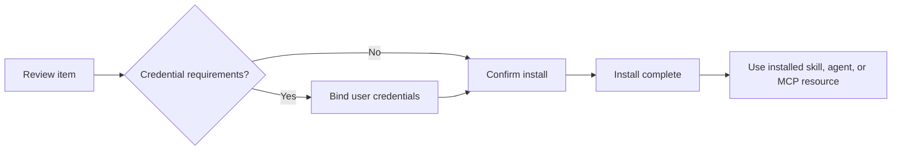

The marketplace install and publish flow turns shared resources into usable Moldy resources. Users can install agents, MCP resources, and skills, bind credentials when required, update installed versions, or remove installations.

The Moldy backend supports item detail, version lookup, install, installation update, uninstall, publish-from-skill, publish new version, ACL management, enable/disable, and operator listing toggles. This page describes those source-confirmed flows without assuming additional marketplace channels.

## Installation flow

When you start installing from the marketplace detail page, the install wizard follows this flow.

| Step | Meaning |
| --- | --- |
| Review | Check item, latest version, origin, support, and credential summary |
| Credentials | Bind user credentials to version credential requirements |
| Confirm | Choose name override and install mode |
| Done | Receive installed resource id and installation status |

## Installation status

Installations can be `active`, `needs_setup`, `disabled`, or `uninstalled`.

| Status | Meaning |
| --- | --- |
| `active` | Ready to use |
| `needs_setup` | Required credentials or setup are missing |
| `disabled` | Disabled installation |
| `uninstalled` | Removed installation |

When required credentials are missing, the server can reject the install or create it in `needs_setup` state. The current install wizard guides users through missing required credentials.

## Update strategies

When an installed item has a newer version, choose an update strategy.

| Strategy | Use when |
| --- | --- |
| `overwrite` | Update the current installed resource |
| `install_new_copy` | Keep the existing resource and install a new copy |
| `keep_current` | Defer the update |

## Publish skills

Moldy can publish a skill as a marketplace item. First publish and new version publish are separate API paths.

1. Prepare the skill, files, and credential requirements.
2. In the publish wizard, enter visibility, name, description, tags, categories, and release notes.
3. For restricted items, choose ACL users.
4. After publishing, check the item detail, version, and publication summary.
5. When adding a new version, include release notes.

Published skills should be treated as reusable software packages. Review the package files, credential requirements, release notes, and visibility before publishing so installers understand what the skill needs and what changed.

## Visibility and listing

| Visibility | Meaning |
| --- | --- |
| `private` | Managed mainly by the owner |
| `restricted` | Shared only with ACL users |
| `public` | Publicly shareable |
| `unlisted` | Available through direct access rather than catalog listing |

Even public items depend on `is_listed=true` for default catalog exposure. The operator moderation page lets a `super_user` approve or unlist public items.

Visibility controls who can access an item, while listing controls whether a public item appears in the default catalog. Keep those decisions separate when documenting marketplace behavior.

<Warning>
Do not publish skill packages that contain secrets. Moldy runs secret scanning on upload/publish paths, but authors should review packages before publishing.
</Warning>
