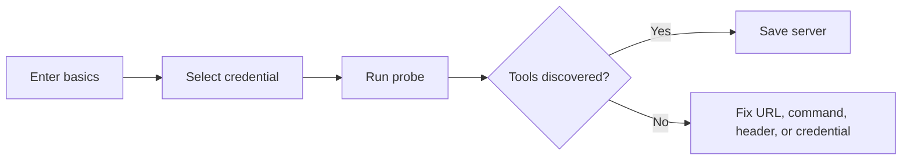

MCP servers connect external tool collections to Moldy. After registration and discovery, Moldy imports MCP tool descriptors that can be attached to agents in settings.

Moldy supports catalog-based creation, manual registration, probe-before-save, tool discovery, and Claude Desktop-style import/export. This page explains the supported registration lifecycle and the checks that help prevent a broken server from becoming an agent dependency.

## Registration paths

| Path | Actual API/UI behavior |
| --- | --- |
| Create from catalog | Choose an entry from `/api/mcp-server-types`, then create via `/api/mcp-servers/from-registry` |
| Manual registration | Enter transport, URL or command, headers, env vars, and credential |
| Import | Send a `{ "mcpServers": { ... } }` payload to `/api/mcp-servers/import` |
| Export | Generate an import-compatible payload from `/api/mcp-servers/export` |

## Choose transport

The API validates `sse`, `streamable_http`, and `stdio` transports.

| Transport | Required values |
| --- | --- |
| `streamable_http` or `sse` | URL |
| `stdio` | command and args |

URL-based transports can use headers. `stdio` servers use command, args, and env vars.

## Probe before saving

The MCP wizard can connect to the server before saving it. `/api/mcp-servers/probe` does not write to the database; it returns server_info, tools, and error details.

Probe results are a pre-save diagnostic, not a guarantee that every later tool call succeeds. After saving a server, run discovery and then test the agent that uses the discovered MCP tool.

## Discover tools and attach them

After saving a server, run tool discovery. Moldy imports MCP tool descriptors as `McpTool` rows. Then select the needed MCP tools in agent settings.

<Warning>
Registering an MCP server does not automatically attach its tools to every agent. Attach MCP tools explicitly in agent settings.
</Warning>

## Import and export

Import accepts the Claude Desktop-style `mcpServers` shape. With `overwrite=false`, same-name servers are skipped. With `overwrite=true`, existing servers are updated in place. Export does not inline secrets; it keeps template strings and credential references.

Exported configuration is intended for reproducible setup, not secret transfer. Review generated payloads before sharing them outside the environment.

## Troubleshooting order

1. Confirm the required URL or command exists for the transport.
2. Check header/env var credential templates.
3. Confirm the credential belongs to the current user.
4. Read the probe error message first.
5. For saved servers, rerun health check and tool discovery.
