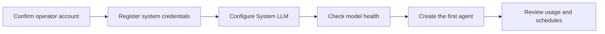

Operator setup prepares the shared Moldy runtime before regular users build agents. System credentials, System LLM settings, and model health should be ready first so agent creation, tool execution, schedules, and usage reporting work reliably.

Use this page as the readiness checklist for a new environment. A regular user can create agents only after the operator-only platform dependencies are configured and tested.

## Confirm operator access

1. Sign in with an administrator account.
2. Confirm that system settings, system credentials, and System LLM are visible in the sidebar.
3. If those menus are missing, check the account's operator role or the deployment's initial administrator setup.

## Register system credentials

System credentials store secrets used by shared models, MCP servers, and built-in tools at the operator scope.

1. Open **System Credentials**.
2. Add a credential for the provider or service.
3. Enter the name, description, and secret value, then save.
4. Keep user-facing descriptions separate from the actual secret values.

System credentials should be named clearly enough for operators to select them without exposing the secret. Screenshots and public docs should show status and configuration shape only.

## Configure System LLM

System LLM is used for platform-level tasks such as recommendations, template assistance, and operator workflows that are separate from user agents.

1. Open **System LLM**.
2. Select the default provider and model.
3. Attach a system credential if the provider requires one.
4. Save and confirm that model calls are available.

## Validate with the first agent

After setup, create a simple manual agent and run a chat. If the agent responds, the usage page records the call, and no operator-only setting is missing, the initial operator setup is ready.

If validation fails, inspect System LLM settings first for Builder and Assistant issues, then check user credentials for normal chat runtime issues.
