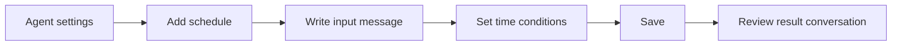

Schedules are Moldy triggers that run agents automatically at configured times or intervals. They let an agent run without a user opening the chat page for every execution.

The **Schedules** page shows scheduled runs and automated responses across agents. Use it to confirm trigger status, next run time, failures, result conversations, and trace links.

## Supported trigger types

The backend schema accepts:

| Type | Purpose |
| --- | --- |
| `one_time` | Run once |
| `interval` | Repeat every configured number of minutes |
| `cron` | Repeat using a cron expression |

Schedules can include `timezone`, `input_message`, `conversation_policy`, `target_conversation_id`, `max_runs`, `end_at`, and `auto_pause_after_failures`.

## Create a schedule

1. Open the **Schedule** panel in agent settings.
2. Write the message the agent should run.
3. Choose `one_time`, `interval`, or `cron`.
4. Confirm timezone and stop conditions.
5. Save, then check next run time in the schedules list.

## Inspect execution results

Scheduled runs create run records. A run can include status, source, input_message, error_message, output_preview, duration, thread_id, checkpoint_id, and trace_id.

Check these fields in the schedules page and agent schedule tab:

- active/paused/completed/error status
- last run status and last error
- next run time
- run count and failure count
- linked result conversation and unread count

## Run now and pause

The trigger API includes `run-now` for immediate execution. Status values include `active`, `paused`, `completed`, and `error`, so check status when pausing or recovering failed schedules.

`run-now` is useful for validating a schedule before waiting for its next natural run. Pause schedules when credentials, model settings, or tool dependencies are being changed.

## Failure checklist

| Symptom | Check |
| --- | --- |
| Model call fails | Model, user credential, fallback model |
| Tool execution fails | Agent tool attachment, credential, MCP server health |
| Run pauses at same step | Whether a tool needs approval/resume |
| Result conversation is missing | Conversation policy and target conversation |
| Wrong execution time | Timezone, cron expression, end_at |

<Tip>
Start scheduled agents with a small input message, then increase frequency after the behavior is stable. Repeated failures can trigger auto-pause policy.
</Tip>
