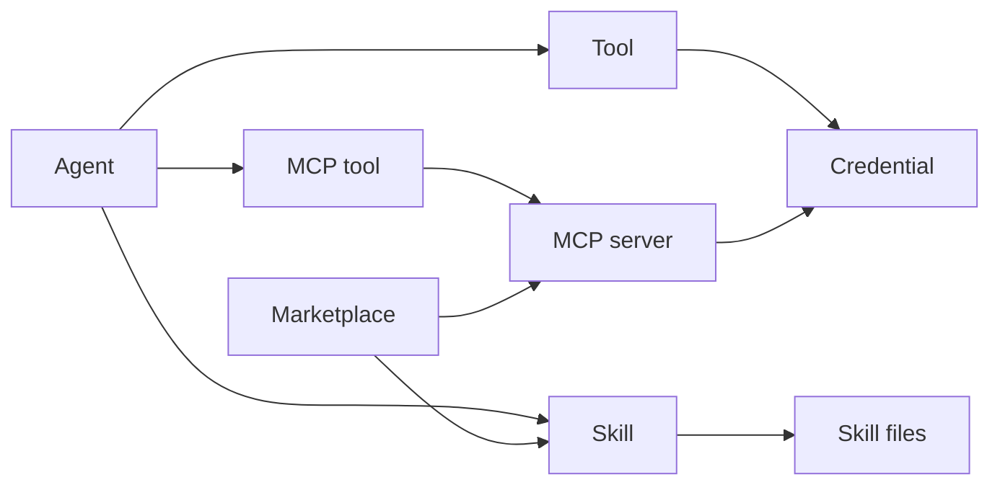

Moldy extensions have three layers: **tools**, **MCP servers**, and **skills**. Tools execute single actions, MCP servers expose external tool collections, and skills provide reusable knowledge, instructions, or files.

They are often used together, but they have different responsibilities. This overview helps you choose the right extension type before editing agent settings.

## What is in the Capabilities menu

The **Capabilities** group in the main sidebar is the collapsible home for agent extension resources. Users prepare or import resources there, then explicitly attach them in agent settings before they reach runtime.

| Menu | What it manages | What users see in chat |
| --- | --- | --- |
| **Tools** | Single executable actions registered in Moldy, including input schemas | Tool-call cards, inputs, outputs, and failure states |
| **MCP Servers** | External MCP servers over stdio, SSE, or Streamable HTTP, plus discovered MCP tools | MCP tool calls, server health, and credential errors |
| **Skills** | `SKILL.md`, instructions, reference files, package assets, and credential requirements | Better agent responses, generated files, and auto-injected tool dependencies |

The Capabilities menu is the resource library; agent settings are the exposure boundary. Registering an MCP server, for example, does not automatically give every agent access to its tools. Select tools, MCP tools, and skills in a specific agent before expecting them in chat runs.

## Compare the layers

| Feature | Main role | Screen | Details |
| --- | --- | --- | --- |
| Tool | Single action an agent can execute | **Tools** | [Manage tools](/hancom/moldy/en/tools) |
| MCP server | Discover and import external tool collections | **MCP Servers** | [Register MCP servers](/hancom/moldy/en/mcp-servers) |
| Skill | Provide knowledge, instructions, and files | **Skills** | [Manage skills](/hancom/moldy/en/skills) |

## Which one should I use?

| Goal | Choose |
| --- | --- |
| Let an agent execute an action already registered in Moldy | Tool |
| Import tools from an external MCP server | MCP server |
| Reuse knowledge or file bundles across agents | Skill |
| Install a package created by someone else | Marketplace |
| Provide a secret required by a tool | User or system credential |

## How they reach an agent

Tools, MCP tools, and skills are attached explicitly in agent settings. Existing in a catalog or being registered on the server does not automatically pass them to every agent.

The attachment step is the main safety boundary. It lets a user register resources broadly but expose only the selected actions and knowledge to a particular agent.

<Steps>
  <Step title="Prepare the resource">
    Review tools, register an MCP server and discover tools, or create a skill.
  </Step>
  <Step title="Prepare credentials">
    Register required user credentials or system credentials.
  </Step>
  <Step title="Attach to the agent">
    Select tools, MCP tools, and skills in agent settings.
  </Step>
  <Step title="Test">
    Run a test chat and confirm actual calls and results.
  </Step>
</Steps>

## Captured screens

