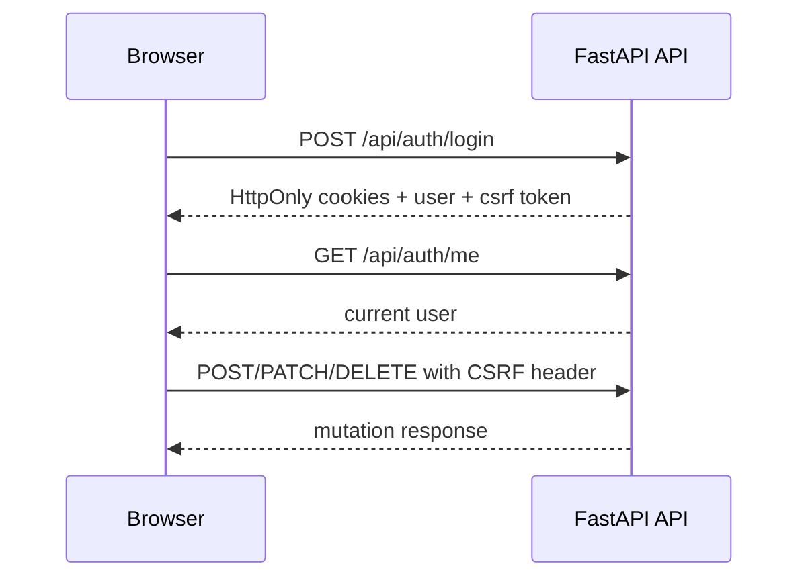

Moldy API 인증은 브라우저 애플리케이션 기준으로 세션 쿠키를 사용합니다. 로그인 후 API는 HttpOnly 쿠키를 설정하고 CSRF 값을 반환하며, 프론트엔드는 상태 변경 요청에 이 CSRF 값을 함께 보냅니다.

이 문서는 API Reference를 사용할 때 알아야 하는 인증 흐름을 설명합니다. endpoint별 문제를 보기 전에 세션 실패, CSRF 실패, 운영자 권한 실패, Agent API 키 실패를 구분할 때 사용하세요.

## 인증 흐름

## 주요 endpoint

| Endpoint | 용도 |
| --- | --- |
| `POST /api/auth/register` | 계정 생성 |
| `POST /api/auth/login` | 이메일/비밀번호 확인, 쿠키 발급, CSRF 값 반환 |
| `POST /api/auth/logout` | 세션 쿠키 제거 |
| `POST /api/auth/refresh` | 세션 갱신 |
| `GET /api/auth/me` | 현재 사용자 확인 |
| `PATCH /api/auth/me/profile` | 표시 이름과 avatar metadata 수정 |
| `/api/auth/me/avatar-image` | 현재 사용자 avatar 이미지 업로드, 조회, 삭제 |

## CSRF가 필요한 요청

상태를 변경하는 요청은 CSRF 검증을 통과해야 합니다. 백엔드 라우터에서 `verify_csrf`가 붙은 요청은 브라우저 세션의 CSRF 값을 함께 보내야 합니다.

대표 예시는 다음과 같습니다.

- 에이전트 생성, 수정, 삭제
- 대화 메시지 전송, resume, edit, regenerate
- 자격증명 생성, 수정, 삭제, 테스트
- MCP 서버 생성, 수정, 삭제, probe, discover, import
- 스케줄 생성, 수정, 삭제, run-now
- 마켓플레이스 설치, 게시, 업데이트, enable/disable
- 공유 링크 생성과 회수
- 프로필, 메모리, 파일, Agent API 배포와 Agent API 키 변경

읽기 요청은 보통 인증 세션만 필요하지만, 상태 변경 요청은 세션 쿠키와 CSRF 헤더가 모두 필요합니다. 이 구조 덕분에 문서 예제에 bearer token을 넣지 않고도 브라우저 기반 API 사용 흐름을 설명할 수 있습니다.

## 운영자 권한

`super_user` 권한이 필요한 endpoint는 일반 사용자가 호출하면 거부됩니다.

| 기능 | 보호 범위 |
| --- | --- |
| 시스템 자격증명 | `/api/system-credentials` |
| System LLM | `/api/system-llm-settings` |
| 모델 catalog mutation | `POST/PATCH/DELETE /api/models` |
| 마켓플레이스 listing | `/api/marketplace/admin/items/{item_id}/listed` |
| k-skill sync 상태 | `/api/marketplace/admin/k-skill/sync` |

운영자 권한은 CSRF와 별개의 검증입니다. 요청이 CSRF 검증을 통과해도 인증 사용자가 `super_user`가 아니면 운영자 endpoint는 실패합니다.

## Agent API 키

공개 `/v1/*` Agent API runtime은 브라우저 cookie를 사용하지 않습니다. **Settings > Agent API**에서 만든 서버용 API 키를 사용합니다. 키는 `invoke`, `stream`, `background`, `read` scope를 가질 수 있고 특정 deployment로 제한할 수 있습니다.

브라우저 세션 API와 Agent API runtime 호출을 분리해서 이해하세요.

| 표면 | 인증 방식 |
| --- | --- |
| `/api/*` 브라우저 앱 endpoint | HttpOnly session cookie, mutation에는 CSRF |
| `/v1/*` Agent API runtime endpoint | 필요한 scope를 가진 Agent API 키 |

<Warning>
API 예제나 문서 캡처에 실제 쿠키, CSRF 토큰, API 키를 넣지 마세요.
</Warning>
