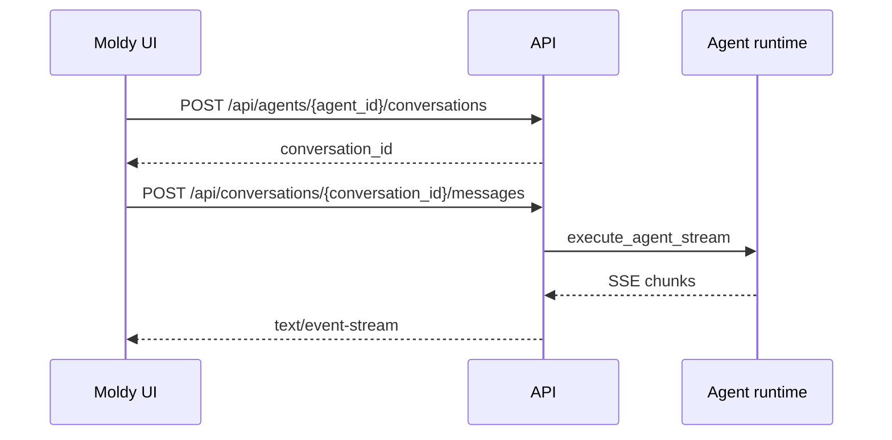

Moldy 채팅은 Server-Sent Events로 에이전트 응답을 스트리밍합니다. 클라이언트는 대화를 만들거나 선택한 뒤 메시지를 보내고, 서버는 텍스트 조각, 도구 이벤트, 오류, 완료 메타데이터를 포함할 수 있는 `text/event-stream` 응답을 보냅니다.

백엔드는 send, resume, edit, regenerate를 같은 SSE 처리 흐름으로 감쌉니다. 따라서 UI는 하나의 스트리밍 처리 경로를 재사용하면서 branch, interrupt, retry 흐름을 지원할 수 있습니다.

## 기본 흐름

## 대화와 메시지 endpoint

| Endpoint | 용도 |
| --- | --- |
| `GET /api/agents/{agent_id}/conversations` | 에이전트별 대화 목록 |
| `POST /api/agents/{agent_id}/conversations` | 대화 생성 |
| `GET /api/conversations/{conversation_id}/messages` | 메시지 목록과 branch metadata |
| `POST /api/conversations/{conversation_id}/messages` | 새 사용자 메시지 전송과 SSE 응답 |
| `GET /api/conversations/{conversation_id}/stream` | run_id 기반 스트림 재연결 |
| `POST /api/conversations/{conversation_id}/messages/resume` | interrupt 이후 실행 재개 |
| `POST /api/conversations/{conversation_id}/messages/edit` | 이전 메시지 수정 후 재실행 |
| `POST /api/conversations/{conversation_id}/messages/regenerate` | 응답 재생성 |
| `POST /api/conversations/{conversation_id}/messages/switch-branch` | 대화 branch 전환 |

## 런타임 구성

메시지를 보내면 백엔드는 대화와 에이전트를 함께 조회하고 다음 값을 런타임 구성에 넣습니다.

- 모델 provider, model_name, base_url
- 사용자 소유 LLM 자격증명
- 에이전트 system prompt
- 내장 도구와 MCP 도구 구성
- 연결된 스킬
- 미들웨어 설정
- 모델 파라미터와 fallback chain
- thread_id, checkpoint_id
- 비용 계산에 필요한 모델 가격 정보

런타임 구성은 저장된 에이전트 설정과 사용자 소유 자격증명을 기준으로 조립됩니다. 시스템 자격증명은 제품 내부 흐름에 예약되어 있으며, 사용자 채팅 자격증명의 일반 대체 수단이 아닙니다.

## resume, edit, regenerate

| 흐름 | 사용할 때 |
| --- | --- |
| resume | 도구 승인 또는 interrupt 이후 같은 실행을 이어갈 때 |
| edit | 이전 사용자 메시지를 바꾸고 그 지점부터 다시 실행할 때 |
| regenerate | 같은 사용자 메시지에 대해 assistant 응답을 다시 만들 때 |

이 세 흐름도 스트림 응답을 사용하므로, 클라이언트는 일반 메시지 전송과 같은 SSE 처리 방식을 재사용할 수 있습니다.

## Trace와 파일

Moldy는 대화별 trace와 debug trace를 조회하는 endpoint를 제공합니다. 대화 파일은 `/api/conversations/{conversation_id}/files/{file_path}`로 가져옵니다. 공개 공유 링크에서도 일부 trace 정보가 read-only snapshot에 포함될 수 있습니다.

Trace 화면은 스트리밍 실행 실패 원인을 설명하는 가장 좋은 근거입니다. 모델 호출, 도구 호출, 런타임 단계, 오류 메시지를 하나의 대화 실행과 연결해서 확인할 수 있습니다.

<Tip>
스트림이 중간에 끊겼다면 `X-Run-Id` 또는 클라이언트가 보관한 run id를 기준으로 stream 재연결 경로를 먼저 확인하세요.
</Tip>
