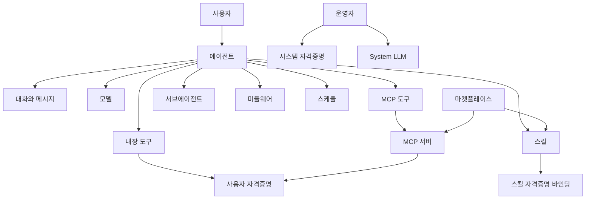

Moldy는 하나의 실행 단위인 에이전트를 중심으로 동작합니다. 에이전트는 대화, 모델 호출, 도구, MCP 서버, 스킬, 자격증명, 스케줄, 사용량, 마켓플레이스 리소스를 연결합니다.

이 문서는 나머지 문서에서 사용하는 용어집 역할을 합니다. 아래 각 개념은 Moldy 객체의 의미, 제품 안에서 나타나는 위치, 설정과 문제 해결에서 중요한 경계를 함께 설명합니다.

## 에이전트

에이전트는 Moldy의 실행 단위입니다. 이름, 설명, 시스템 지침, 모델, 모델 파라미터, fallback 모델, 도구, MCP 도구, 스킬, 서브에이전트, 미들웨어, 오프너 질문, 스케줄을 가질 수 있습니다.

저장된 에이전트 record는 채팅, 테스트 채팅, 스케줄이 런타임에 읽는 기준입니다. 에이전트가 기대와 다르게 동작하면 런타임 trace를 보기 전에 저장된 설정을 먼저 확인하세요.

에이전트를 만들 때 가장 중요한 질문은 세 가지입니다.

- 이 에이전트가 어떤 업무를 책임지는가?
- 답변만 하면 되는가, 외부 도구를 실행해야 하는가?
- 사용자가 직접 실행하는가, 스케줄로 자동 실행하는가?

## 대화와 메시지

대화는 에이전트별 thread입니다. 메시지, 파일, 도구 결과, usage, trace 정보가 대화에 연결됩니다. 메시지를 보내면 서버는 에이전트 설정을 읽어 런타임 구성을 만들고 SSE 스트림으로 응답합니다.

대화에는 branch 전환, edit, regenerate, resume 같은 흐름이 있습니다. 승인이나 interrupt 이후 이어서 실행해야 할 때는 resume 흐름을 사용합니다.

## 도구와 MCP 도구

도구는 에이전트가 실행할 수 있는 작업입니다. Moldy에는 일반 도구와 MCP 서버에서 발견한 MCP 도구가 분리되어 있습니다.

| 항목 | 설명 |
| --- | --- |
| 도구 | Moldy에 등록된 단일 작업 |
| MCP 서버 | 외부 도구 목록을 제공하는 서버 |
| MCP 도구 | MCP 서버에서 발견되어 Moldy에 가져온 도구 |

MCP 서버를 등록하고 도구를 발견한 뒤에도, 에이전트 설정에서 MCP 도구를 선택해야 해당 에이전트가 사용할 수 있습니다.

## 스킬

스킬은 지식, 지침, 파일, 실행 패키지를 묶는 단위입니다. 스킬은 에이전트에 연결될 수 있고, 마켓플레이스에 게시될 수 있으며, 필요한 사용자 자격증명을 요구사항으로 선언할 수 있습니다.

스킬은 다음 상황에 적합합니다.

- 특정 업무 지식이나 문서 묶음을 재사용할 때
- 에이전트마다 같은 지침을 반복해서 넣고 싶지 않을 때
- 마켓플레이스에 공유 가능한 패키지를 만들 때

## 서브에이전트와 미들웨어

서브에이전트는 한 에이전트가 다른 에이전트를 보조 실행 단위로 활용하는 구조입니다. 미들웨어는 런타임 동작을 확장하는 설정입니다. 둘 다 에이전트 설정에서 선택하며, 백엔드는 중복 서브에이전트 ID와 등록되지 않은 미들웨어 type을 검증합니다.

## 모델과 자격증명

모델은 LLM catalog 항목이고, 자격증명은 모델이나 도구를 호출하기 위한 비밀값입니다.

| 구분 | 관리 주체 | 사용처 |
| --- | --- | --- |
| 사용자 자격증명 | 일반 사용자 | 개인 에이전트, 도구, MCP 서버, 모델 테스트 |
| 시스템 자격증명 | 운영자 | Builder, Assistant, 이미지 생성, System LLM |
| 모델 catalog | 운영자 중심 | 에이전트 모델 선택, System LLM 선택 |

사용자 채팅 런타임은 사용자 소유 LLM 자격증명을 우선 사용합니다. 시스템 자격증명은 운영자 범위의 제품 내부 흐름에 사용됩니다.

## 스케줄

스케줄은 에이전트를 자동 실행하는 trigger입니다. Moldy는 `interval`, `cron`, `one_time` 타입을 받고, 실행 결과를 run 기록과 대화로 연결합니다.

스케줄에는 다음 값이 포함됩니다.

- 입력 메시지
- timezone
- conversation policy와 target conversation
- max runs
- 종료 시각
- 실패 후 자동 pause 기준

## 마켓플레이스

마켓플레이스는 스킬, 에이전트, MCP 리소스를 찾고 설치하는 catalog입니다. 현재 구현은 catalog, detail, version, install, update, uninstall, skill publish, ACL, operator listing 관리를 포함합니다.

## 접근과 공개 공유

대부분의 리소스는 현재 사용자 소유 범위로 제한됩니다. 운영자 기능은 `super_user`가 필요합니다. 공유 링크는 예외적으로 로그인 없이 볼 수 있는 read-only 대화 snapshot을 제공합니다.

이 소유권 모델은 Moldy 전반에서 가장 중요한 제약입니다. 사용자 소유 리소스는 다른 사용자의 일반 목록에 나타나지 않아야 하고, 운영자 리소스는 일반 사용자 계정에서 수정할 수 없어야 합니다.
