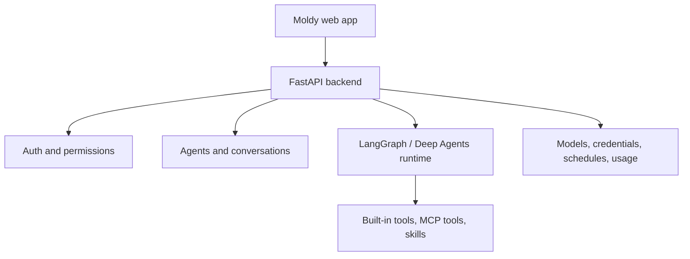

Moldy는 대화, 템플릿, 직접 설정 방식으로 AI 에이전트를 만들고 운영하는 웹 애플리케이션입니다. 에이전트는 모델, fallback 모델, 도구, MCP 도구, 스킬, 서브에이전트, 미들웨어, 스케줄, 자격증명, 메모리, 생성 파일, 마켓플레이스 리소스, Agent API 배포, 대화 공유 링크를 사용할 수 있습니다.

현재 제품은 Next.js 프론트엔드와 FastAPI 백엔드로 구성되어 있으며, 실제 기능은 프론트 라우트, 백엔드 OpenAPI, 실행 화면을 기준으로 문서화합니다. 이 문서는 Moldy에서 확인된 동작만 다루며, Moldy 소스에 없는 외부 제품 기능은 설명하지 않습니다.

## 할 수 있는 일

- 대화형 빌더, 직접 만들기, 템플릿으로 에이전트를 생성합니다.
- 에이전트별 채팅, 대화 목록, 공유 링크, 시각 설정을 관리합니다.
- 도구, MCP 서버, 스킬을 연결해 에이전트 기능을 확장합니다.
- 사용자 자격증명, 시스템 자격증명, 모델, 메모리, 파일, System LLM 설정을 분리해 운영합니다.
- 스케줄, 사용량, 마켓플레이스, 운영자 관리 기능을 한 곳에서 확인합니다.
- 조건을 만족하는 fixed-identity 에이전트를 Agent API로 배포해 서버에서 외부 호출합니다.

## 제품 구조

## 문서 근거

| 근거 유형 | 사용처 |
| --- | --- |
| 프론트엔드 라우트 | 사용자 흐름, 화면, navigation, 설정 패널 |
| OpenAPI 스냅샷 | endpoint 그룹, 요청 흐름, 인증 경계 |
| 브라우저 캡처 | screenshot 기반 화면 상태와 UI 문구 |
| 소스 인벤토리 | 기능 범위와 문서 갱신 추적 |

## 현재 메뉴 모델

Moldy의 기본 사이드바는 에이전트 작업에 집중합니다. **새 에이전트**, **에이전트 템플릿**, **마켓플레이스**, Tools/MCP Servers/Skills를 묶은 접이식 **기능** 그룹, 최근 에이전트가 있습니다. 사용자 메뉴에서 여는 설정 사이드바에는 계정, API, 파일, 자격증명, 모델, 스케줄, 사용량, 운영자 설정이 있습니다.

전체 메뉴 지도는 [앱 설정과 내비게이션](/hancom/moldy/ko/settings)을 참고하세요.

## 다음 단계

처음 사용하는 경우 [빠른 시작](/hancom/moldy/ko/quickstart)에서 로그인, System LLM 확인, 첫 에이전트 생성, 채팅까지 이어서 진행하세요. 실제 업무 흐름을 따라 하고 싶다면 [사용 시나리오와 레시피](/hancom/moldy/ko/recipes)를, 자주 묻는 질문은 [FAQ](/hancom/moldy/ko/faq)를 참고하세요.
