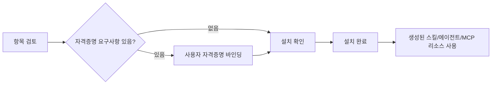

마켓플레이스 설치와 게시 흐름은 공유 리소스를 실제로 사용할 수 있는 Moldy 리소스로 전환합니다. 사용자는 에이전트, MCP 리소스, 스킬을 설치하고, 필요한 경우 자격증명을 연결하고, 설치된 버전을 업데이트하거나 제거할 수 있습니다.

Moldy 백엔드는 항목 상세, 버전 조회, 설치, 설치 업데이트, 제거, 스킬 게시, 새 버전 게시, ACL 관리, enable/disable, 운영자 listing 토글을 제공합니다. 이 문서는 소스에서 확인된 흐름만 설명하며, 추가 마켓플레이스 채널을 가정하지 않습니다.

## 설치 흐름

마켓플레이스 detail 화면에서 설치를 시작하면 설치 wizard가 다음 흐름을 진행합니다.

| 단계 | 실제 의미 |
| --- | --- |
| 검토 | item, latest version, origin, support, credential summary 확인 |
| 자격증명 | version의 credential requirements에 사용자 자격증명을 바인딩 |
| 확인 | 이름 override와 설치 mode를 정함 |
| 완료 | 설치된 resource id와 installation status를 받음 |

## 설치 상태

설치 결과는 `active`, `needs_setup`, `disabled`, `uninstalled` 상태를 가질 수 있습니다.

| 상태 | 의미 |
| --- | --- |
| `active` | 사용할 수 있는 설치 |
| `needs_setup` | 필수 자격증명이 빠졌거나 추가 설정이 필요 |
| `disabled` | 비활성화된 설치 |
| `uninstalled` | 제거된 설치 |

필수 자격증명이 없을 때 Moldy는 서버 정책에 따라 설치를 거부하거나 `needs_setup` 상태로 설치할 수 있습니다. 현재 설치 wizard는 빠진 필수 자격증명이 있으면 설정 필요 상태를 안내합니다.

## 업데이트 전략

설치된 항목에 새 버전이 있으면 update strategy를 선택합니다.

| 전략 | 적합한 상황 |
| --- | --- |
| `overwrite` | 현재 설치 리소스를 새 버전으로 갱신 |
| `install_new_copy` | 기존 리소스를 보존하고 새 복사본 설치 |
| `keep_current` | 업데이트를 미루고 현재 설치 유지 |

## 스킬 게시

Moldy는 스킬을 마켓플레이스 항목으로 게시할 수 있습니다. 첫 게시와 새 버전 게시 API가 분리되어 있습니다.

1. 스킬을 준비하고 파일과 자격증명 요구사항을 정리합니다.
2. 게시 wizard에서 visibility, 이름, 설명, 태그, 카테고리, release notes를 입력합니다.
3. restricted 항목이면 ACL 사용자 목록을 지정합니다.
4. 게시 후 항목 detail에서 버전과 publication summary를 확인합니다.
5. 기존 항목에 새 버전을 추가할 때는 release notes를 남깁니다.

게시된 스킬은 재사용 가능한 소프트웨어 패키지처럼 다루어야 합니다. 설치자가 무엇이 필요하고 무엇이 바뀌었는지 이해할 수 있도록 게시 전에 패키지 파일, 자격증명 요구사항, release notes, visibility를 확인하세요.

## 공개 범위와 listing

| Visibility | 설명 |
| --- | --- |
| `private` | 작성자 중심으로 관리되는 항목 |
| `restricted` | ACL에 포함된 사용자에게만 공유 |
| `public` | 공개 가능 항목 |
| `unlisted` | 링크나 직접 접근 중심의 공개 항목 |

public 항목이라도 catalog 기본 노출은 `is_listed=true` 상태에 따라 달라집니다. 운영자 관리 화면은 `super_user`가 public item의 listed 상태를 승인하거나 내리는 데 사용합니다.

Visibility는 항목에 접근할 수 있는 사용자를 제어하고, listing은 public 항목이 기본 catalog에 노출되는지 제어합니다. 마켓플레이스 동작을 설명할 때 두 결정을 분리해서 확인하세요.

<Warning>
마켓플레이스에 게시할 스킬 패키지에는 비밀값을 포함하지 마세요. Moldy는 업로드/게시 경로에서 secret scan을 수행하지만, 게시 전 작성자가 한 번 더 확인해야 합니다.
</Warning>
