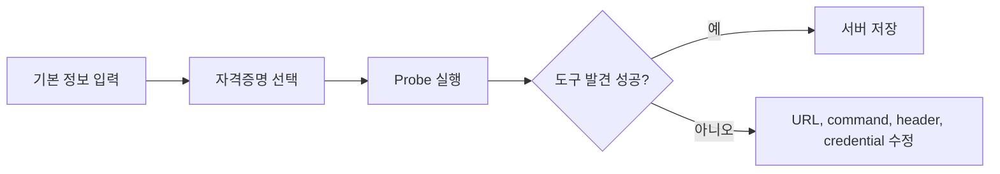

MCP 서버는 외부 도구 묶음을 Moldy에 연결합니다. 등록과 발견이 끝나면 Moldy는 MCP tool descriptor를 가져오고, 사용자는 에이전트 설정에서 필요한 MCP 도구를 연결할 수 있습니다.

Moldy는 catalog 기반 생성, 수동 등록, 저장 전 probe, 도구 발견, Claude Desktop 형태의 가져오기/내보내기를 지원합니다. 이 문서는 지원되는 등록 lifecycle과 깨진 서버가 에이전트 의존성이 되기 전에 확인할 점을 설명합니다.

## 지원되는 등록 방식

| 방식 | 실제 API/화면 동작 |
| --- | --- |
| catalog에서 만들기 | `/api/mcp-server-types` 목록을 고르고 `/api/mcp-servers/from-registry`로 생성 |
| 수동 등록 | transport, URL 또는 command, headers, env vars, credential을 입력 |
| 가져오기 | `/api/mcp-servers/import`로 `{ "mcpServers": { ... } }` 구조를 가져옴 |
| 내보내기 | `/api/mcp-servers/export`로 다시 가져올 수 있는 구조를 생성 |

## Transport 선택

Moldy API는 `sse`, `streamable_http`, `stdio` transport를 검증합니다.

| Transport | 필요한 값 |
| --- | --- |
| `streamable_http` 또는 `sse` | URL |
| `stdio` | command와 args |

URL 기반 transport는 headers를 사용할 수 있고, `stdio` 기반 서버는 env vars와 command/args 조합을 사용합니다.

## 저장 전 probe

MCP wizard는 저장 전에 서버에 연결해 도구 목록을 미리 확인할 수 있습니다. `/api/mcp-servers/probe`는 DB에 저장하지 않고 server_info, tool 목록, error를 반환합니다.

Probe 결과는 저장 전 진단 정보이지 이후 모든 도구 호출 성공을 보장하지 않습니다. 서버를 저장한 뒤에는 도구 발견을 실행하고, 발견된 MCP 도구를 사용하는 에이전트까지 테스트하세요.

## 도구 발견과 에이전트 연결

서버 저장 후 **도구 발견**을 실행하면 Moldy가 MCP 서버의 tool descriptor를 가져와 `McpTool`로 저장합니다. 이후 에이전트 설정의 MCP 도구 목록에서 필요한 도구를 선택합니다.

<Warning>
MCP 서버를 등록해도 모든 에이전트가 자동으로 해당 도구를 쓰지는 않습니다. 에이전트 설정에서 MCP 도구를 명시적으로 연결해야 합니다.
</Warning>

## 가져오기와 내보내기

가져오기는 Claude Desktop 스타일의 `mcpServers` 구조를 받습니다. `overwrite=false`이면 같은 이름의 서버는 건너뛰고, `overwrite=true`이면 기존 서버를 갱신합니다. 내보내기는 secret 값을 풀어 쓰지 않고 템플릿 문자열과 credential reference를 유지합니다.

내보낸 구성은 재현 가능한 설정을 위한 것이지 secret 전달을 위한 것이 아닙니다. 환경 밖으로 공유하기 전에는 생성된 payload를 검토하세요.

## 문제 해결 순서

1. transport에 필요한 URL 또는 command가 있는지 확인합니다.
2. header/env var에 credential 템플릿을 잘못 넣지 않았는지 확인합니다.
3. credential picker에서 현재 사용자 소유 자격증명을 선택했는지 확인합니다.
4. probe 오류 메시지를 먼저 읽습니다.
5. 저장된 서버라면 **상태 확인**과 **도구 발견**을 다시 실행합니다.
