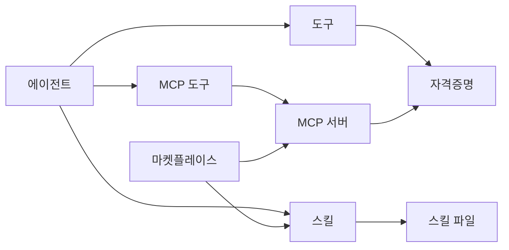

Moldy의 확장 기능은 **도구**, **MCP 서버**, **스킬** 세 층으로 나뉩니다. 도구는 단일 액션을 실행하고, MCP 서버는 외부 도구 묶음을 노출하며, 스킬은 재사용 가능한 지식, 지침, 파일을 제공합니다.

세 기능은 함께 쓰이지만 책임이 다릅니다. 이 개요는 에이전트 설정을 수정하기 전에 어떤 확장 방식을 선택할지 판단하는 데 사용합니다.

## 기능 메뉴에 있는 항목

메인 사이드바의 **기능** 그룹은 에이전트가 사용할 수 있는 확장 리소스를 모아 둔 접이식 메뉴입니다. 이 메뉴에서 리소스를 만들거나 가져온 뒤, 실제 에이전트 설정에서 선택해야 런타임에 전달됩니다.

| 메뉴 | 무엇을 관리하나요? | 채팅에서 보이는 결과 |
| --- | --- | --- |
| **도구** | Moldy에 등록된 단일 실행 액션과 입력 스키마 | 도구 호출 카드, 입력/출력, 실패 상태 |
| **MCP 서버** | stdio, SSE, Streamable HTTP 방식의 외부 MCP 서버와 발견된 MCP 도구 | MCP 도구 호출, 서버 health, credential 오류 |
| **스킬** | `SKILL.md`, 지침, 참조 파일, 패키지 asset, credential requirement | 에이전트 응답 품질, 파일 생성, 자동 주입된 tool dependency |

기능 메뉴는 리소스 저장소이고, 에이전트 설정은 노출 범위입니다. 예를 들어 MCP 서버를 등록해도 모든 에이전트가 그 도구를 자동으로 쓰지는 않습니다. 특정 에이전트의 설정에서 도구, MCP 도구, 스킬을 연결해야 채팅 실행에 포함됩니다.

## 세 기능 비교

| 기능 | 핵심 역할 | 관리 화면 | 상세 문서 |
| --- | --- | --- | --- |
| 도구 | 에이전트가 실행하는 단일 액션 | **도구** | [도구 관리](/hancom/moldy/ko/tools) |
| MCP 서버 | 외부 도구 묶음을 발견하고 가져옴 | **MCP 서버** | [MCP 서버 등록](/hancom/moldy/ko/mcp-servers) |
| 스킬 | 지식, 지침, 파일 패키지를 제공 | **스킬** | [스킬 관리](/hancom/moldy/ko/skills) |

## 어떤 것을 써야 하나요?

| 원하는 일 | 선택 |
| --- | --- |
| 이미 Moldy에 등록된 작업을 에이전트가 실행하게 하기 | 도구 |
| 외부 MCP 서버의 도구 목록을 가져오기 | MCP 서버 |
| 여러 에이전트에 같은 업무 지식이나 파일 묶음을 재사용하기 | 스킬 |
| 다른 사용자가 만든 패키지를 설치하기 | 마켓플레이스 |
| 특정 도구 실행에 비밀값이 필요하기 | 사용자 자격증명 또는 시스템 자격증명 |

## 에이전트에 연결되는 방식

도구, MCP 도구, 스킬은 모두 에이전트 설정에서 명시적으로 연결합니다. catalog에 존재하거나 서버에 등록되어 있어도 에이전트에 연결하지 않으면 런타임에 전달되지 않습니다.

연결 단계는 중요한 안전 경계입니다. 리소스를 넓게 등록하더라도 특정 에이전트에는 선택한 액션과 지식만 노출할 수 있습니다.

<Steps>
  <Step title="리소스 준비">
    도구를 확인하거나, MCP 서버를 등록해 도구를 발견하거나, 스킬을 만듭니다.
  </Step>
  <Step title="자격증명 준비">
    필요한 사용자 자격증명 또는 시스템 자격증명을 등록합니다.
  </Step>
  <Step title="에이전트에 연결">
    에이전트 설정에서 도구, MCP 도구, 스킬을 선택합니다.
  </Step>
  <Step title="테스트">
    테스트 채팅에서 실제 호출과 결과를 확인합니다.
  </Step>
</Steps>

## 캡처된 화면

